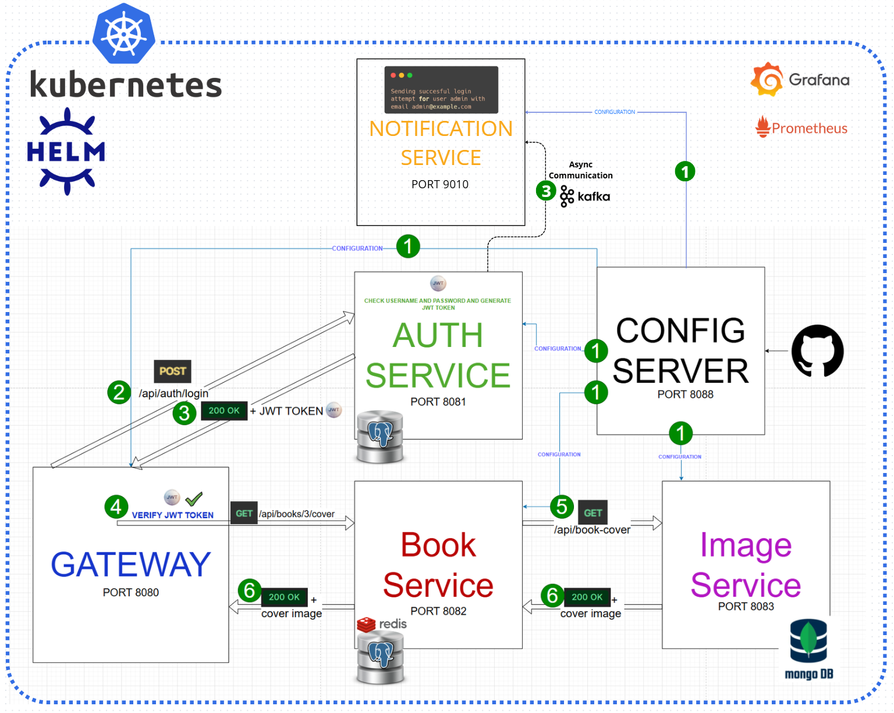

# 📚 Library3000App – Innowise Internship

🎯 **Internship Goal**
The goal of the internship was to create a comprehensive library management application, starting from a simple console program and evolving into a full-scale microservices system with advanced security mechanisms, support for large datasets, and cloud scalability.

📋 **Internship Progress (Task 0–13)**

**Task 0: Migration Tool**
Development of a database migration tool inspired by Liquibase/Flyway:

* Analysis of existing migration tools
* Implementation in plain Java using JDBC
* Handling SQL scripts with versioning and checksums
* Transactional execution of migrations
* Support for OneToOne, OneToMany, and ManyToMany relationships

**Task 1–2: Spring Core + CSV**
Console application for book management:

* Storing data in CSV files
* CRUD operations via console interface
* Dependency Injection with Spring Context
* Jackson CSV Mapper for file handling

**Task 3: Internationalization + AOP**

* Multi-language support (EN/PL) via MessageSource
* Method logging using Aspect-Oriented Programming
* Simple method result caching using HashMap

**Task 4: JDBC + PostgreSQL**

* Migration from CSV to PostgreSQL
* Implementation using Spring JDBC
* Database schema with authors, genres, and relationships
* CRUD operations directly via JDBC

**Task 5: Hibernate ORM**

* Replacing JDBC with Hibernate
* Criteria API for advanced queries
* Cache configuration (L1, L2, query cache)
* Entity mapping with 1:1, 1\:N, N\:M relationships

 **Task 6: Spring Boot + REST API**

* Migration to Spring Boot
* REST API implementation following best practices
* API documentation via Postman
* Spring Data JPA + Liquibase for migrations

**Task 7: MongoDB + GridFS**

* Adding support for book cover images
* Storing large files in GridFS
* Endpoints for uploading/downloading files
* Handling multipart/form-data

**Task 8: Spring Security + JWT**

* JWT authentication system
* User roles (USER, ADMIN)
* BCrypt password hashing
* Secured endpoints with access control

**Task 9: Testing**

* Unit tests (JUnit, Mockito)
* Integration tests with Testcontainers
* REST controller tests
* Ensuring code quality

**Task 10: Microservices Architecture**

* Split into 4+ microservices (Gateway, Auth, Book, Image)
* Spring Cloud Gateway + Config Server
* Service discovery via Consul
* Circuit Breaker pattern (Resilience4j)

**Task 11: Docker + Kafka**

* Containerization of all services
* Docker Compose to run the full environment
* Asynchronous communication via Apache Kafka
* SonarQube + Checkstyle integration

**Task 12: Kubernetes + Monitoring**

* Deployment on Kubernetes cluster (Minikube)
* Helm charts for external services
* Monitoring via Prometheus + Grafana
* Java application profiling

**Task 13: Advanced Topics**

* Redis caching for performance optimization
* Implementation of additional mechanisms
* System optimization
* Preparing for production deployment

🛠 **Technology Stack**

🔹 **Languages & Frameworks**

* Java 17/21 – main programming language
* Spring Boot – application framework
* Spring Security – authentication and authorization
* Spring Cloud – microservices architecture
* Hibernate – ORM and persistence management

🔹 **Databases**

* PostgreSQL – main relational database
* MongoDB – document storage and GridFS
* Redis – data caching

🔹 **Developer Tools**

* Docker & Docker Compose – containerization
* Kubernetes – container orchestration
* Apache Kafka – asynchronous communication
* Liquibase – database migration management

🔹 **Testing & Quality**

* JUnit 5 – testing framework
* Mockito – mocking objects
* Testcontainers – integration testing
* Checkstyle – code quality checks
* SonarQube – static code analysis

🔹 **Monitoring & DevOps**

* Prometheus – metrics collection
* Grafana – metrics visualization
* Consul – service discovery
* Helm – Kubernetes package manager

🎓 **Skills Acquired**

🔹 **Technical**

* Designing and implementing REST APIs
* Application security (JWT, OAuth2)
* Microservices architecture
* Containerization and orchestration
* Working with multiple databases
* Testing at different levels

🔹 **Soft Skills**

* Working with Git version control
* Documenting projects
* Troubleshooting technical problems
* Optimizing application performance
* Collaboration in a development team

📊 **Summary**
During the internship, the full application development path was covered – from a simple console program to a fully-featured microservices system ready for production deployment. Each task built upon the previous ones, gradually adding new functionalities and advanced mechanisms.

📈 **Key Achievements**
✅ Full Java/Spring technology stack
✅ Practical microservices architecture experience
✅ Advanced security mechanisms
✅ Containerization and orchestration
✅ Comprehensive testing and monitoring
✅ Production-ready application

