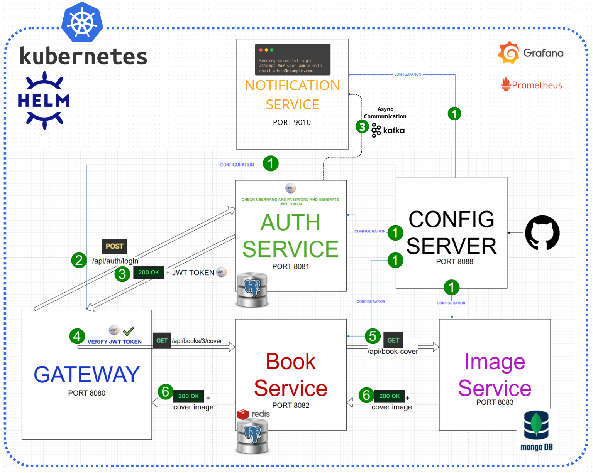
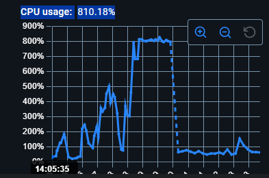
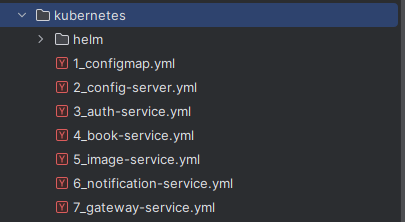
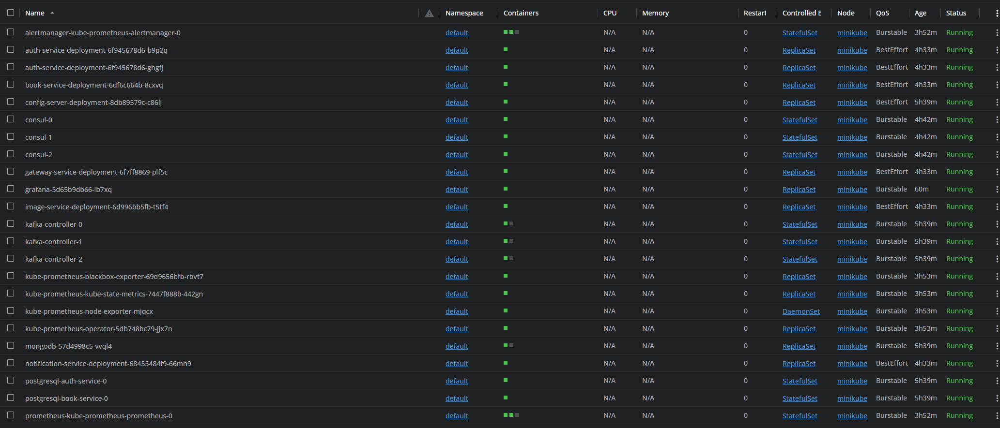
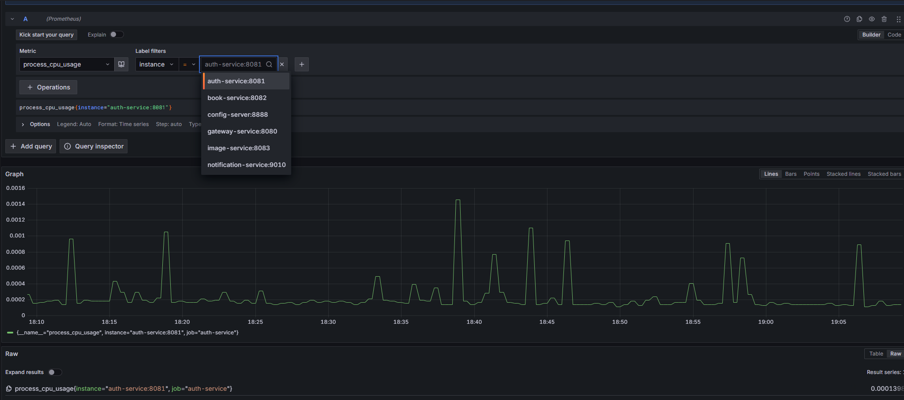
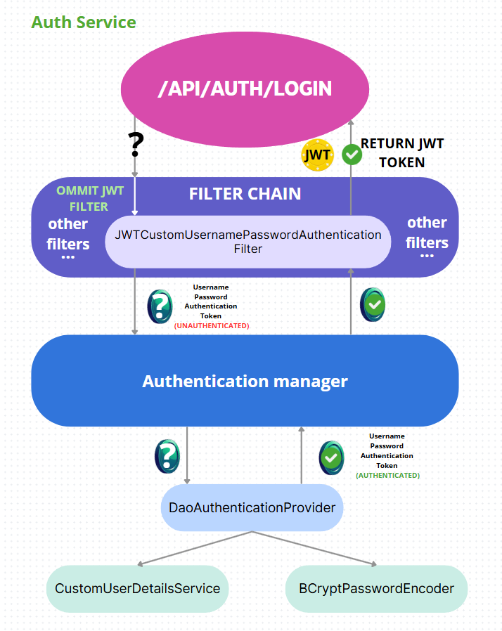
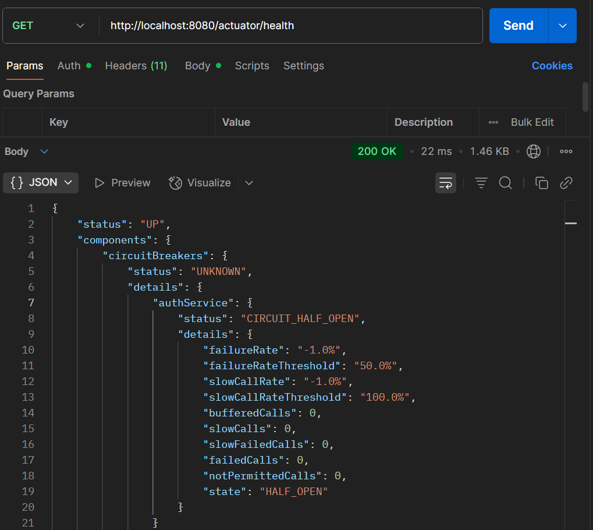

# 📚 Library3000App

---

**Library3000** is a microservices-based library management system that allows users to add, update, delete, and search books efficiently. It supports secure user authentication and role-based access control. The application also manages book cover images and sends notifications on key events. The project is designed to run efficiently in modern cloud environments.
---
✨ Features

- ✅ Retrieve all books
- ✅ Retrieve a book by ID
- ✅ Add a new book
- ✅ Update an existing book
- ✅ Delete a book
- ✅ Search books by keyword (Spring JPA query)
- ✅ Upload and download book covers using GridFS (supports JPG and PNG)
- ✅ Global exception handling
- ✅ Spring Security with JWT authentication
- ✅ Role-based access control (USER, ADMIN)
- ✅ Test endpoint accessible only by ADMIN
- ✅ User registration and login with JWT token generation
- ✅ Event-driven communication using Apache Kafka
- ✅ Code quality enforcement using Checkstyle plugin




---
**Service Table**

| **Service**                                   | **Port** | **Description**                                                                                |
| --------------------------------------------- | -------- |------------------------------------------------------------------------------------------------|
| [Gateway](http://localhost:8080)              | 8080     | Entry point for all API requests (Spring Cloud Gateway) + Spring Security to verify JWT tokens |
| [Auth Service](http://localhost:8081)         | 8081     | Handles JWT token generation                                                                   |
| [Book Service](http://localhost:8082)         | 8082     | Manages books, CRUD operations, and secured endpoints                                          |
| [Image Service](http://localhost:8083)        | 8083     | Uploading/downloading book cover images using GridFS                                           |
| [Config Server](http://localhost:8888)        | 8888     | Centralized configuration server (fetches from GitHub repo)                                    |
| [Consul](http://localhost:8500)               | 8500     | Service discovery and health checks                                                            |
| [Notification Service](http://localhost:9010) | 9010     | Sends email notification(logger)                                                               |

---

## 🛠 Requirements

* Java 21
* Gradle
* Docker & Docker Compose
* Postman (for API testing)

---

## 🚀 Setup & Running

### 1️⃣ Start the Database

Run the following command in the project root to start the application in Docker containers.
Note: Since the project uses a custom Dockerfile, the image build process might take some time — please be patient 🕒.

```sh
docker-compose up -d
```
After that you can visit the application at `http://localhost:8500`


---

## 🐳 Dev-Friendly Docker Compose

For easier development, the project includes a **`docker-compose.dev.yaml`** file.

### 🎯 Purpose

Use it when you want to:

* Run only core services (e.g., PostgreSQL, MongoDB, Consul)
* Start other microservices manually in your IDE

### 🚀 How to Use

```sh
docker compose -f docker-compose.dev.yaml up -d
```

This setup speeds up development and gives you full control over which services run locally.

---

## Kubernetes Deployment☸️

The project is fully deployable to Kubernetes.

It has been tested on a **Minikube** cluster.

Since the default cluster settings caused it to shut down frequently and run very slowly — with some microservices failing their **liveness** and **readiness** probes — I recommend starting Minikube with higher resource limits.
I used:

```bash
minikube start --memory=15000 --cpus=8
```

This is probably more than necessary especially RAM, but during startup the CPU usage spikes significantly, reaching up to **800%**.
You can, of course, test with lower settings if desired.
With this settings startup takes around 7-8 minutes.



---

All Kubernetes configuration files are located in the `kubernetes` folder.
They use public Docker Hub images from `treladev` as well as **Bitnami** images.



The setup is a mix of two deployment approaches:

* **Helm charts** for external services
* **Kubernetes manifests** (`kubectl apply`) for the application’s own microservices

Below is the full deployment process (run these commands from inside the `kubernetes` folder):

```bash
cd helm
helm install consul consul
helm install kafka kafka
helm install mongodb mongodb
helm install postgresql-auth-service postgresql-auth-service
helm install postgresql-book-service postgresql-book-service
helm install kube-prometheus kube-prometheus
helm install grafana grafana
helm install redis redis
cd ..
kubectl apply -f 1_configmap.yml
kubectl apply -f 2_config-server.yml
kubectl apply -f 3_auth-service.yml
kubectl apply -f 4_book-service.yml
kubectl apply -f 5_image-service.yml
kubectl apply -f 6_notification-service.yml
kubectl apply -f 7_gateway-service.yml
```

Once the pods are ready (screenshot below):



---

### Accessing Consul UI

Port-forward Consul to your local machine:

```bash
kubectl port-forward svc/consul-ui 8500:80
```

Then open [http://localhost:8500](http://localhost:8500)


---

### Testing the Application

Port-forward the **gateway service**:

```bash
kubectl port-forward svc/gateway-service 8080:8080
```

You can also access **Grafana**:

```bash
kubectl port-forward svc/grafana 3000:3000
```

Get the Grafana admin password in PowerShell:

```powershell
$secret = kubectl get secret grafana-admin --namespace default -o jsonpath="{.data.GF_SECURITY_ADMIN_PASSWORD}"
[System.Text.Encoding]::UTF8.GetString([System.Convert]::FromBase64String($secret))
```

After logging in to Grafana, you can browse metrics from Prometheus.




---


## ⚙️ Configuration Server

The application uses a centralized **Spring Cloud Config Server** that retrieves external configurations from the following GitHub repository:

📁 Config Repository:
`https://github.com/TrelaDev-Innowise/library3000-microservices-config`

All services automatically fetch their configuration from this repository upon startup.

---
## 🔐 Authentication & Authorization

The application uses **Spring Security** with **JWT** tokens for authentication and role-based authorization.




### Available Test Users

| Username | Password | Roles |
| -------- | -------- | ----- |
| admin    | admin    | ADMIN |
| user1    | user1    | USER  |
| user2    | user2    | USER  |
| user3    | user3    | USER  |
| user4    | user4    | USER  |
| user5    | user5    | USER  |

---

All endpoints (the entire collection) are available in the **Postman** folder and are ready to be imported into Postman.


## 📡 Authentication Endpoints

### 📝 Register a New User

```
POST http://localhost:8080/api/auth/register
```

**Request Body (JSON):**

```json
{
  "username": "newuser",
  "password": "newpassword",
  "email": "user@example.com"
}
```

---

### 🔑 Login (Get JWT Token)

```
POST http://localhost:8080/api/auth/login
```

**Request Body (JSON):**

```json
{
  "username": "admin",
  "password": "admin"
}
```

**Response:**

* JWT token will be returned in the **Authorization** header as `Bearer <token>`.
* Use this token to authorize subsequent requests.
* Upon successful login, a **login event** is published.
* This event is consumed by the **Notification Service** via Kafka.
* The Notification Service then simulates sending an email notification by logging the message, for example:

```
2025-08-07T10:46:32.534Z  INFO 1 --- [notification-service] [container-0-C-1] d.t.n.functions.MessageFunctions         : Sending successful login attempt for user admin with email admin@example.com
```
---

### 🔒 Using the JWT Token

For secured endpoints (including all book-related APIs):

* In Postman, go to the **Authorization** tab
* Choose **Bearer Token** type
* Paste the JWT token (without the `Bearer` prefix)
* Make your API requests


---

## 📡 API Endpoints (via Postman)

### 📖 Get All Books

```
GET http://localhost:8080/api/books
```

### 📖 Get Book by ID

```
GET http://localhost:8080/api/books/{id}
```

Example:

```
GET http://localhost:8080/api/books/2
```

### ➕ Add a New Book

```
POST http://localhost:8080/api/books
```

**Request Body (JSON):**

```json
{
  "title": "Murder on the Orient Express",
  "description": "Hercule Poirot investigates a murder on a snowbound train.",
  "pages": 256,
  "rating": 4.30,
  "authors": [
    {"name": "Agatha Christie"},
    {"name": "Alex Michaelides"}
  ],
  "genre": {
    "name": "Mystery"
  }
}
```

### ✏️ Update a Book

```
PUT http://localhost:8080/api/books/{id}
```

**Request Body (JSON):**

```json
{
  "title": "UPDATE",
  "description": "UPDATE",
  "pages": 100,
  "rating": 5.00,
  "authors": [
    {"name": "UPDATED AUTHOR"},
    {"name": "UPDATEDAUTHOR2"}
  ],
  "genre": {
    "name": "Mystery"
  }
}
```

### 🔍 Search Books by Keyword

```
GET http://localhost:8080/api/books/search?keyword=tolkien
```

### ❌ Delete a Book

```
DELETE http://localhost:8080/api/books/{id}
```

Example:

```
DELETE http://localhost:8080/api/books/1
```

---

## 📸 Book Cover Upload & Download (GridFS)


### ➕ Upload Book Cover

Upload a book cover image (supported formats: **JPG**, **PNG**) using:

**🔒 Access Restricted:**

📌 **This endpoint is accessible only to users with the `ADMIN` role.**
Make sure you are logged in as an **admin user** before making this request.

**✅ Admin Credentials:**

```json
{
  "username": "admin",
  "password": "admin"
}
```


```
POST http://localhost:8080/api/books/{id}/cover
```

**Request:**

* Use `form-data` in Postman.
* Add a key named `coverImage` with the image file you want to upload as the value.

Example:

| Key        | Type | Value               |
| ---------- | ---- | ------------------- |
| coverImage | File | your\_cover.jpg/png |

---

### 📥 Download Book Cover

Retrieve the cover image for a book using:

```
GET http://localhost:8080/api/books/{id}/cover
```

This endpoint returns the image binary data with appropriate content-type (`image/jpeg` or `image/png`) so it can be displayed or saved.

---

## ✅ Tests Included

The project includes both **integration** and **unit tests** to ensure reliability and correctness of key functionalities.

### 🔬 Integration Tests (`controller` package)

Integration tests verify that the application components work together as expected using real HTTP requests and a containerized PostgreSQL instance via **Testcontainers**.

Examples:

* `AuthControllerIT`: Tests user registration and input validation.
* `BookControllerIT`: Covers book creation, retrieval by ID, and listing all books.

These tests use `TestRestTemplate` and start the application on a random port.

### ⚙️ Unit Tests (`service` package)

Unit tests validate individual service logic with mocked dependencies using **JUnit 5** and **Mockito**.

Examples:

* `BookServiceTest`: Verifies authors and genres are properly processed before saving a book.
* `GenreServiceTest`: Ensures genre retrieval works as expected.
* `UserServiceTest`: Validates user registration rules and handles duplicate usernames or invalid inputs.

All tests are located under the `src/test/java/dev/trela/` directory and can be run using:

```sh
./gradlew test
```

Test results will be available in the `build/reports/tests/test/index.html` file after execution.

---

## 🛡️ Circuit Breaker (Resilience4j)

The application uses **Resilience4j** to implement circuit breakers for fault tolerance and graceful degradation when dependent services become unavailable.

### 🔌 Testing Circuit Breaker Functionality

To simulate a service failure and observe circuit breaker behavior, you can temporarily **stop one of the microservices**, such as the **Auth Service**.

#### 🔁 Example Scenario: Auth Service Failure

1. **Stop the Auth Service**:

2. **Attempt to login** via the Gateway:

   ```http
   POST http://localhost:8080/api/auth/login
   ```

   **Expected Response:**

   

   This response is returned by the circuit breaker's fallback mechanism when the Auth Service is unavailable.

3. **Check Circuit Breaker State**:
   You can monitor the state of the circuit breaker using the Spring Boot actuator endpoint:

   ```
   GET http://localhost:8080/actuator/health
   ```

   This will display the health status of the gateway and include information about the circuit breakers — for example, whether the circuit is **OPEN**, **CLOSED**, or **HALF\_OPEN**.




---

In each microservice, you can run the command:

```
gradle checkstyleMain
```

This command checks your source code against the coding rules defined in the configuration file located at `config/checkstyle/checkstyle.xml`. It provides a report comparing your code to these restrictions and highlights any violations.


If you prefer, you can also use the Google Style standard by renaming the configuration file to `checkstyle.xml`, and then running the Checkstyle plugin with that configuration to enforce Google’s coding conventions.

---

## ⚡ Redis Cache Integration

To improve performance and minimize database queries, **Book Service** uses **Redis** as a caching layer.

### 🔥 Main Use Cases:

* Caching results of book queries (`findAll`, `findById`, `searchByKeyword`)
* Automatic cache eviction after adding, updating, or deleting a book
* Spring Cache configuration (`@EnableCaching`, `@Cacheable`, `@CacheEvict`)

Example usage in the Book Service:

```java
@Cacheable(value = "books", key = "#id")
public Book getBookById(Long id) { ... }

@CacheEvict(value = "books", key = "#id")
public void deleteBook(Long id) { ... }
```

This ensures that frequently accessed data is stored in RAM, reducing response times and offloading the PostgreSQL database.


Here’s the updated section with Redis included:

---

## ⚙️ Technologies Used

* **Java 21** – Primary programming language
* **Spring Boot** – Microservices foundation (REST, DI, AOP)
* **Spring Security with JWT** – Role-based authentication and authorization
* **Spring Cloud Gateway** – API gateway with circuit breakers and load balancing
* **Spring Cloud Config Server** – Externalized configuration management
* **Spring Data JPA** – Database abstraction (Book & Auth services)
* **PostgreSQL** – Main relational database
* **MongoDB GridFS** – Storage for book cover images (Image Service)
* **Redis** – Caching layer for Book Service to improve performance and reduce database load
* **Liquibase** – Automated database migrations
* **Consul** – Service discovery and service registry
* **Circuit Breaker (Resilience4j)** – Fault tolerance and graceful fallback for failing services
* **Load Balancer (Spring Cloud LoadBalancer)** – Client-side load balancing between service instances
* **Docker & Docker Compose** – Containerized deployment of all services
* **Kubernetes** – Container orchestration and management platform
* **Helm** – Kubernetes package manager for simplified deployments
* **Testcontainers** – Integration testing with containerized PostgreSQL
* **JUnit 5 & Mockito** – Unit and integration testing
* **Postman** – API testing tool
* **Lombok** – Reduces boilerplate code (e.g., constructors, getters/setters)
* **Apache Kafka** – Event streaming platform for asynchronous communication between microservices
* **Checkstyle** – Static code analysis tool to enforce coding standards and style guidelines
* **Prometheus** – Metrics and monitoring platform
* **Grafana** – Metrics and monitoring dashboard

