As part of this task, I also had to perform profiling of any microservice.

I chose the auth-service.

💡 In short:

* **Profiling (VisualVM, JMC, etc.)** → **low-level**, detailed, JVM-level:

  * you see specific objects in memory, their count and size,
  * you analyze specific threads and their states,
  * you can investigate memory leaks, deadlocks, code hotspots.

* **Monitoring (Prometheus + Grafana)** → **high-level**, aggregated metrics:

  * CPU, RAM, response time, request count, GC time, etc.,
  * you observe trends over time,
  * good for alerts and overall system health, but without diving into JVM object details.

---

Memory Leak | Heap & Thread Dump

We will use VisualVM

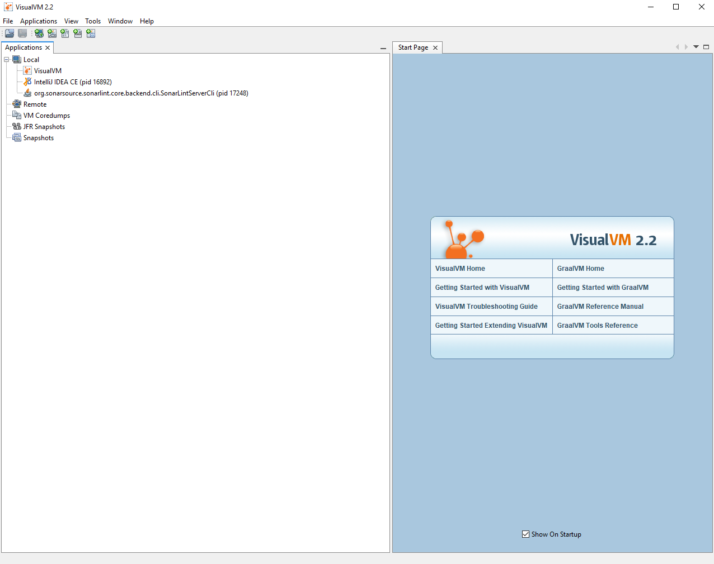

We start our microservices and can take a look at
AuthService

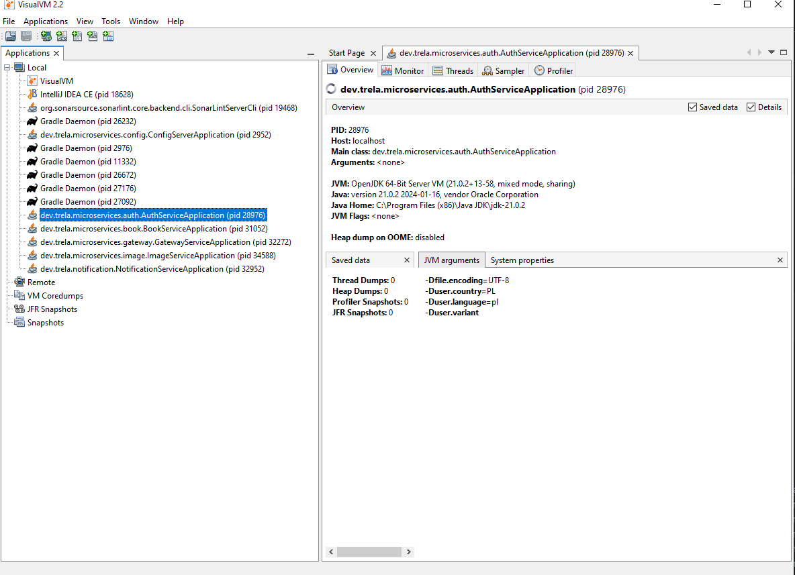

Below are all the statistics.


---

### 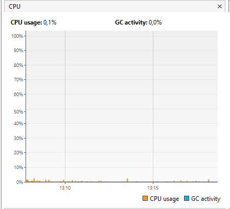

As we can see in the **Monitor** tab, there are statistics displayed:

* **CPU usage 0.1%** — which is rather low usage.
* **GC activity 0.0%** — meaning Garbage Collector activity is zero.

This means the application has no traffic and is basically in an idle state.

**Why is this important?**

* **CPU usage** shows how intensively the application uses the processor — important to detect excessive load or inactivity.
* **GC activity** shows how often and how much time the JVM spends cleaning up unused objects — a key indicator of the application's memory health.

**Example failures or issues indicated by these stats:**

* Long, frequent GC pauses (high GC activity) — can cause "stop-the-world" pauses, stopping the app during cleanup and affecting responsiveness.
* High CPU usage without visible cause — might mean memory leaks causing continuous GC, deadlocks, or infinite loops.
* Zero CPU usage and GC activity for a long time despite expected traffic — might indicate the app is stuck or not functioning properly.

**Conclusion:** Low CPU and zero GC activity indicate the app is idle and practically not processing any tasks.

---

### 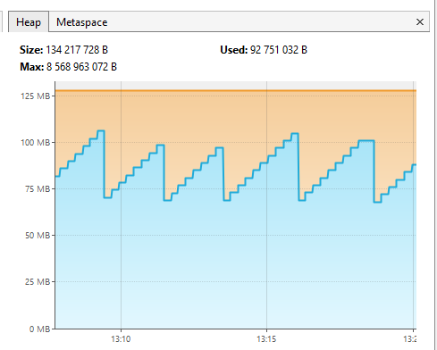

Next, the **Heap** tab graph:

* **Size:** 134,217,728 B (\~128 MB) — JVM has currently reserved 128 MB of system memory for the heap.
* **Used:** 96,945,336 B (\~92 MB) — out of the reserved memory, about 92 MB is currently occupied by objects in your app (or its libraries).
* **Max:** 8,568,963,072 B (\~8 GB) — if needed, JVM can expand the heap up to 8 GB (set by -Xmx or default config).

The app is currently using about 72% of the memory JVM reserved (92 MB / 128 MB).

The spikes on the graph (so-called "teeth") happen because of sudden increases (creating new objects) followed by their removal, and this cycle repeats.

**What kind of objects could these be if we are not even using or interacting with the app?**

* **Logging** — every log message (even debug or heartbeat) creates Strings, StringBuilders, date/time objects.
* **HTTP requests and responses** — your app regularly sends HTTP queries to Consul (e.g., health checks, fetching configs). Each request and response creates objects: requests/responses, buffers, parsed JSON or other data formats.
* Parsing responses creates new objects (e.g., maps, lists, strings).

**Why is this needed?**

* **Heap graph monitoring** helps you see how much memory is currently used by objects, how much is reserved, and how much is still available.
* Detect memory usage spikes — sudden memory increases may indicate lots of objects being created then cleaned by GC.
* Prevent failures — if heap memory nears max, OutOfMemoryError may occur, stopping the app.
* Optimize GC — watching memory cycles helps tune Garbage Collector settings better.

**Examples of failures/problems indicated by the heap graph:**

* OutOfMemoryError: Java heap space — when the app uses more memory than heap provides, often due to memory leaks or large in-memory data.
* High, continuous memory usage without drops — might signal a memory leak where objects are not freed despite no use.
* Frequent, long GC pauses — caused by too many objects to clean, affecting performance and responsiveness.
* Memory spikes without interaction — might be background activity like logging, config refresh via HTTP, or periodic tasks.

**Conclusion:** The app is running stably, using a moderate portion of allocated heap memory with plenty of headroom for growth.

---

### 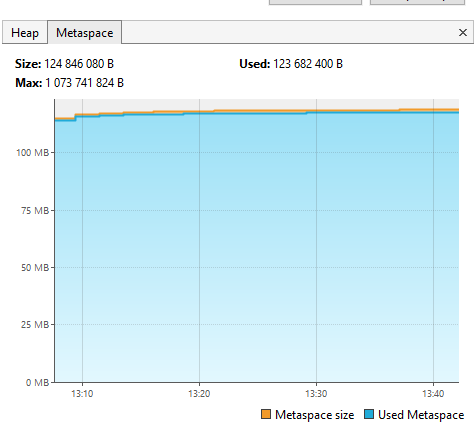

The **Metaspace** tab graph — memory allocated for:

**Examples of data stored in Metaspace:**

* Class definitions
* Class names, e.g., com.example.User
* Superclass info, e.g., java.lang.Object
* Implemented interfaces
* Class fields (names, types, modifiers like private, static)
* Class methods (names, signatures, bytecode instructions)
* ClassLoader info — which ClassLoader loaded the class
* Reflection and dynamic loading metadata
* Annotations
* Information about class structure and runtime inspection.

**Why is this important?**
The metaspace graph shows how JVM manages memory dedicated to classes — so you can detect memory problems before they cause failures.

**Examples of issues indicated:**

* OutOfMemoryError: Metaspace — when usage nears the limit and the app tries to load new classes.
* ClassLoader memory leaks — continuous increase without drops means old classes are not unloaded.
* Problems with dynamic class loading — e.g., app servers loading and refreshing modules/plugins but not freeing memory.


**Conclusion:** Metaspace is almost fully used (\~99% of reserved memory), indicating heavy load on class metadata memory, but still with some margin up to \~1 GB max. It may be worth considering increasing the Metaspace size to prevent potential `OutOfMemoryError` issues if the application needs to load more classes.

---

### 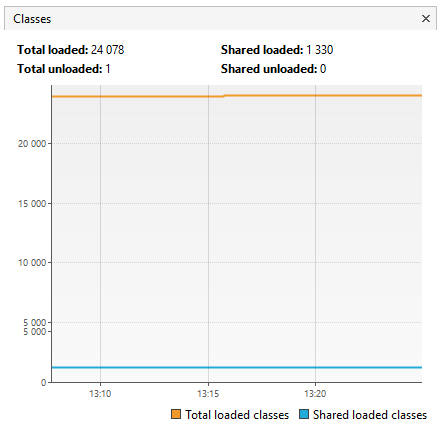

These are **class loading statistics** from JVM shown by VisualVM:

* **Total loaded: 24,078** — total number of classes loaded since app start.
* **Shared loaded: 1,330** — number of classes loaded via Class Data Sharing (CDS), a JVM mechanism to share classes between Java processes to save memory and speed startup.

**How does it work without CDS?**
Imagine you run several Java apps simultaneously, each needing similar classes (Java base classes, libraries, frameworks).
Each JVM loads its own copy separately, which wastes memory.

**Total unloaded: 1** — classes loaded and then unloaded during JVM runtime (unloading is rare, usually happens when safe to remove).
**Shared unloaded: 0** — classes unloaded from CDS (here zero).

**Why is this needed?**

* Detect class leaks — if total loaded keeps growing but unloaded remains low, it may indicate ClassLoader leaks (common in server apps during redeploy).
* Optimize memory — CDS shares classes across processes, reducing memory usage.
* Monitor dynamic loading/unloading — important for apps with plugins or hot-reloading.

**Example problems:**

* Class memory leaks — continuous Total loaded increase with little unloading may cause OutOfMemoryError Metaspace.
* ClassLoader issues — classes not unloaded after redeploy cause memory growth.
* Inefficient CDS usage — low Shared loaded means CDS is not configured correctly, causing higher memory use.

**Conclusion:** JVM loaded 24,093 classes, with 1,330 via CDS, and only 1 unloaded — indicating stable class memory management without major leaks or issues.

---

### 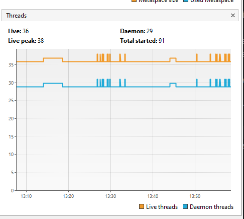

**What does each element mean?**

* **Live:** 36 — currently active (live) threads in JVM.
* **Daemon:** 29 — out of live threads, 29 are daemon threads (background threads that don’t prevent JVM shutdown).
* **Live peak:** 38 — highest number of simultaneously live threads since JVM start.
* **Total started:** 91 — total threads created since JVM start (including finished ones).

**Why is this important?**
Monitoring thread count helps detect management issues such as:

* Thread leaks — threads created but never ending can exhaust system resources.
* Excessive thread count — too many threads overload CPU and memory, reducing performance.
* Distinguishing daemon from normal threads helps understand which are critical vs background (e.g., monitoring, config refresh).
* Live peak shows if high thread load periods occur.
* Total started shows app’s dynamic thread creation/removal behavior (e.g., thread pools).

**Example issues:**

* Continuous increase of live threads without decrease — indicates thread leaks, risking memory/resource exhaustion.
* Very high live thread count (hundreds or thousands) — overloads CPU, responsiveness drops, longer context switches.
* Low or missing thread endings (Total started >> Live) — may indicate threads not closed properly or many short-lived threads created excessively.

**Conclusion from numbers:**
We have 36 active threads, 29 are daemons — normal for mostly background threads.
Live peak 38 means thread count is stable with little change.
Total started 91 shows no excessive thread creation since start.

**Conclusion:** The app has stable, moderate thread usage without signs of leaks or overloads.

**Note:** Thread count analysis depends largely on the type of application. Smaller applications usually have just a few threads, while larger, more complex applications may have dozens or even hundreds. However, if you observe something like 500 or more live threads in an application that doesn’t require such scale, it could indicate problems such as thread leaks or inefficient thread management.

---
Sure! Here is the English translation of your text:

---

Now let’s move on to Heap Dump.

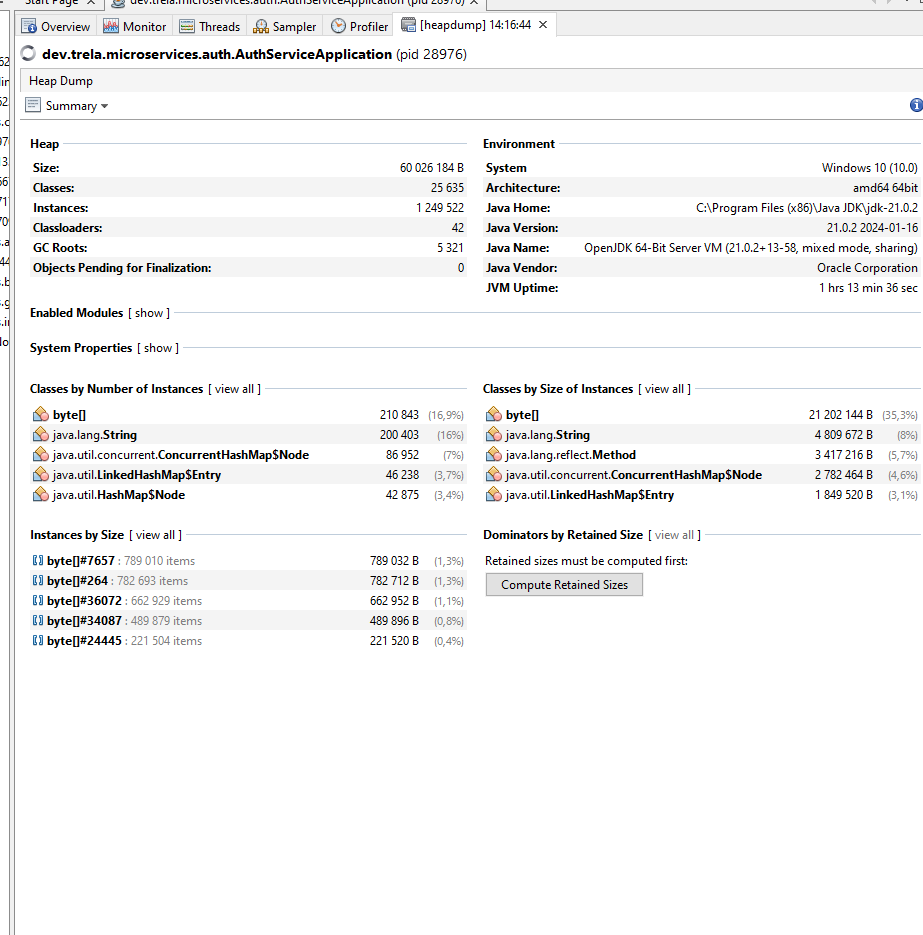

Heap dump is simply a snapshot of the heap memory at a given moment.

We can go to the **Objects** tab:

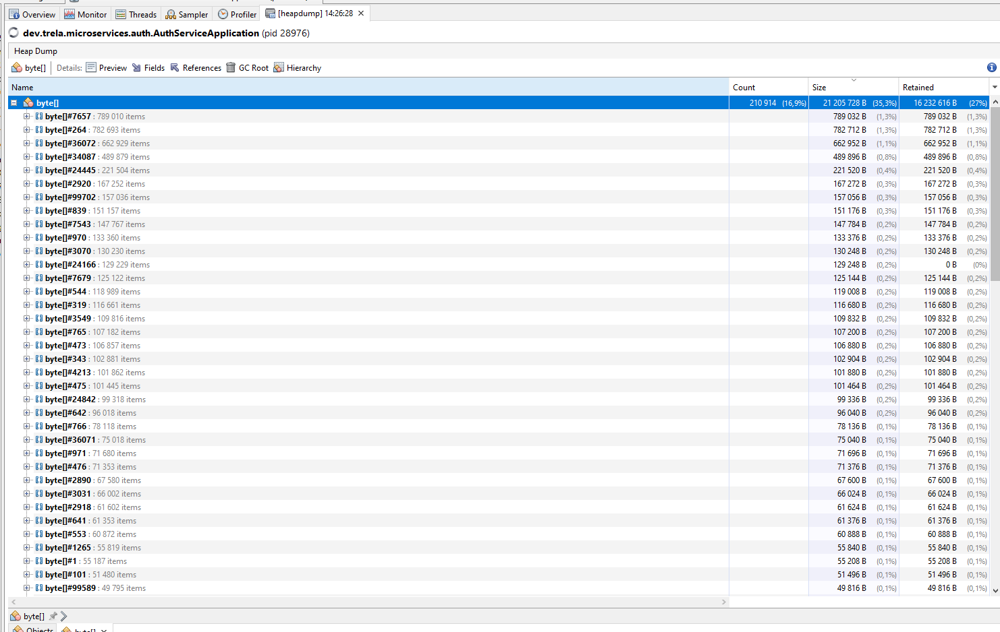

There are 3 columns:

1. **Count**
   The number of instances of a given object type in memory at the time of the heap dump.
   For example, if `byte[]` has a count of 210,914, it means there are exactly that many byte arrays in memory.

2. **Size**
   The total memory (in bytes) occupied by all instances of that object type.
   For example, if the size for `byte[]` is 100 MB, then all those 210 thousand instances together take up 100 MB of memory.

3. **Retained Size**
   This is more important and a bit more advanced — it shows how much memory would be freed if those objects were removed **together with all other objects that are only reachable through them**.
   In other words:

If we remove these objects, how much memory would the system reclaim?

Retained size shows the “total cost” of keeping these objects and everything that cannot be freed because of them.

---

We can see that the most instances are of the object `byte[]` — 210,914 —
which accounts for 16.9% of all objects in this dump.

Why is this important?
**Memory usage analysis:**
`byte[]` arrays are often used to store binary data, e.g., buffers, deserialization results, images, network data, etc.
A large number of such objects may indicate where most memory is going.

**Detecting potential problems:**
If `byte[]` is so dominant, it might mean:

* Large data buffering — is this normal?
* Memory leaks — maybe these arrays are created but not released, e.g., due to long-held references.
* Excessive creation and destruction of large arrays — which can impact performance and increase GC frequency.

**Application optimization:**
Knowing that `byte[]` takes up a lot of space, we can:

* Check if the size of these arrays can be reduced.
* Optimize buffering or data processing.
* Inspect the code that most frequently creates these arrays.

---

There is an even better tool for investigating leaks, called **Eclipse MAT (Memory Analyzer Tool)**.
To use it, we need a heap dump file.

Our `auth-service` runs on port 8081.
From the console folder where we want to save our heap dump file, run:

```bash
curl http://localhost:8081/actuator/heapdump -o heap.hprof
```

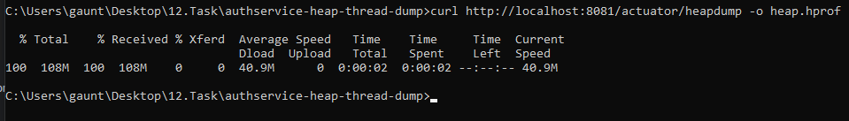

This gives us an `.hprof` file, which we can open in VisualVM:

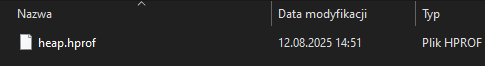
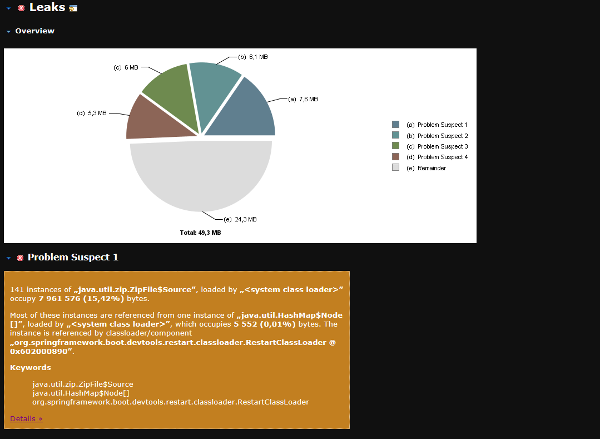

---

Example output:
141 instances of `java.util.zip.ZipFile$Source`, loaded by `<system class loader>`, occupy 7,961,576 bytes (15.42%).

Most of these instances are referenced from one instance of `java.util.HashMap$Node[]`, loaded by `<system class loader>`, which occupies 5,552 bytes (0.01%).
This instance is referenced by classloader/component `org.springframework.boot.devtools.restart.classloader.RestartClassLoader @ 0x602000890`.

**Keywords:**

* java.util.zip.ZipFile\$Source
* java.util.HashMap\$Node\[]
* org.springframework.boot.devtools.restart.classloader.RestartClassLoader

---

This is a hint for us that we can consider **disabling DevTools in the production environment**.

---

As we can see, we have a problem with the use of `ZipFile` — the class we saw earlier in VisualVM —
responsible for 15.42% of all heap objects.

This suggests we may want to disable Spring Boot DevTools in production. DevTools uses its own class loader (RestartClassLoader), which can cause many objects (such as `java.util.zip.ZipFile$Source` and related structures) to be retained in memory, potentially leading to unnecessary memory consumption or leaks.
Therefore, it is often recommended to disable DevTools in production to avoid such issues.

---

**Now let's move on to the thread dump**

A thread dump is a snapshot of all threads running in a Java application at a given moment. Here is how you can analyze this file:

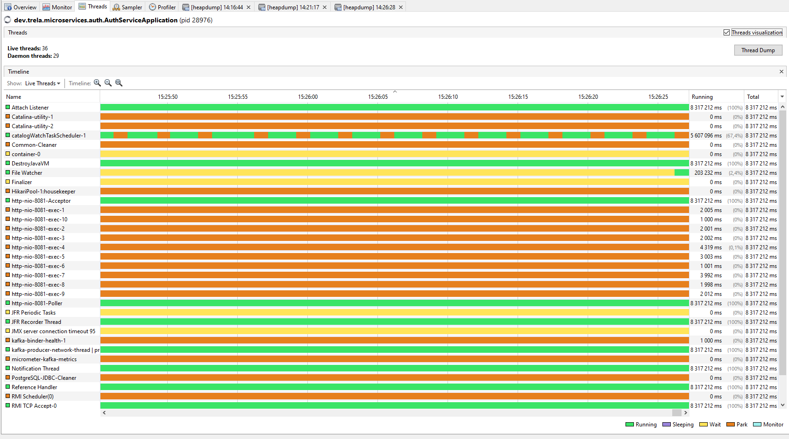

We generate a thread dump using the same button,
and the output is text like this:

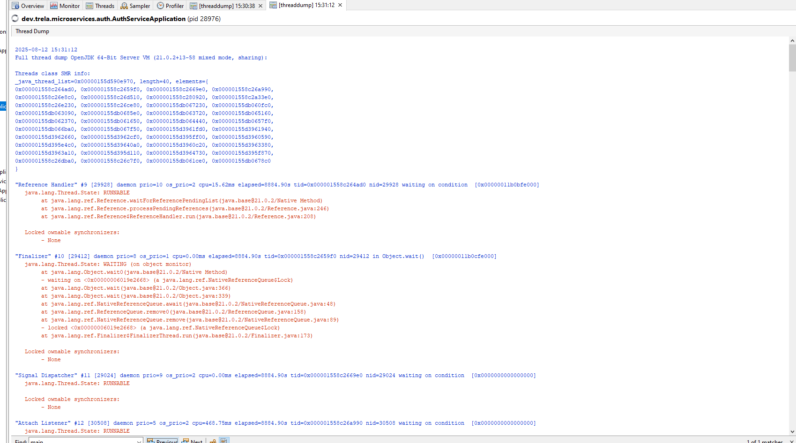

We can read such a report ourselves.

**How to read a thread dump**
We should look for threads in states:

* **BLOCKED** — may indicate deadlocks
* **WAITING / TIMED\_WAITING** — normal for threads waiting for work; we can also find deadlocks this way
* **RUNNABLE** — actively executing code

Check CPU time (`cpu=xxx`) — high values may indicate problems.

Look for similar stack traces — many threads with the same stack may point to an issue.

---

**Potential problems**

The **File Watcher thread (#68):**

* Has used **205,046.88 ms** CPU time (about 205 seconds)

* This may indicate intensive file scanning, which can burden the system

```
"File Watcher" #68 [34804] daemon prio=5 os_prio=0 cpu=205046.88ms elapsed=8849.75s tid=0x00000155db065160 nid=34804 waiting on condition  [0x00000011b39fe000]
java.lang.Thread.State: TIMED_WAITING (sleeping)
    at java.lang.Thread.sleep0(java.base@21.0.2/Native Method)
    at java.lang.Thread.sleep(java.base@21.0.2/Thread.java:509)
    at org.springframework.boot.devtools.filewatch.FileSystemWatcher$Watcher.scan(FileSystemWatcher.java:277)
    at org.springframework.boot.devtools.filewatch.FileSystemWatcher$Watcher.run(FileSystemWatcher.java:261)
    at java.lang.Thread.runWith(java.base@21.0.2/Thread.java:1596)
    at java.lang.Thread.run(java.base@21.0.2/Thread.java:1583)

Locked ownable synchronizers:  
- None
```

The **File Watcher** also comes from **DevTools**, so this is another indication that we should disable DevTools in production.

---

