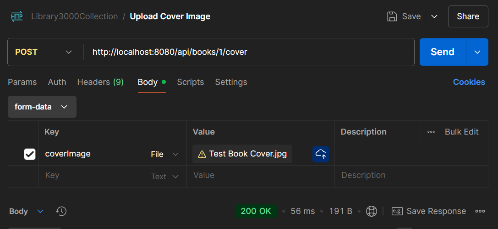

# 📚 Library3000App

**Library3000App** is a Spring Boot-based RESTful application for managing books. It uses **Spring Data JPA** for database interaction and stores data in a **PostgreSQL** database running in **Docker**. The application exposes a REST API, which can be tested via **Postman**.

---

## ✨ Features

✅ Retrieve all books
✅ Retrieve a book by ID
✅ Add a new book
✅ Update an existing book
✅ Delete a book
✅ Search books by keyword (Spring JPA query)
✅ Upload and download book covers using **GridFS** (supports JPG and PNG)
✅ Global exception handling

---

## 🛠 Requirements

* Java 21
* Gradle
* Docker & Docker Compose
* Postman (for API testing)

---

## 🚀 Setup & Running

### 1️⃣ Start the Database

Run the following command in the project root to start PostgreSQL via Docker Compose:

```sh
docker-compose up -d
```

### 2️⃣ Build the Project

Use Gradle to build the application:

```sh
./gradlew build
```

### 3️⃣ Run the Application

After building the project, navigate to the output directory:

```sh
cd build/libs
```

Then run the application:

```sh
java -jar Library3000App-1.0-SNAPSHOT.jar
```

📌 **Liquibase** will automatically initialize the database schema and insert sample data.

---

## 📂 Project Structure

```
Library3000/
├── Postman/                    # Postman collection with API requests
├── src/
│   └── main/
│       ├── java/
│       │   └── trela/
│       │       ├── config/              # Spring configuration
│       │       ├── controller/          # REST controllers
│       │       ├── exception/           # Global error handling
│       │       ├── model/               # Domain models
│       │       ├── repository/          # Spring Data JPA repositories
│       │       ├── service/             # Business logic
│       │       ├── util/                # Utilities
│       │       └── Library3000App.java  # Main class
│       └── resources/
│           ├── changelog/              # Liquibase changelog SQL files
│           ├── application.properties
│           ├── messages_en.properties
│           └── messages_pl.properties
├── docker-compose.yaml
├── build.gradle.kts
├── settings.gradle.kts
```

---

## 📡 API Endpoints (via Postman)

### 📖 Get All Books

```
GET http://localhost:8080/api/books
```

### 📖 Get Book by ID

```
GET http://localhost:8080/api/books/{id}
```

Example:

```
GET http://localhost:8080/api/books/2
```

### ➕ Add a New Book

```
POST http://localhost:8080/api/books
```

**Request Body (JSON):**

```json
{
  "title": "Murder on the Orient Express",
  "description": "Hercule Poirot investigates a murder on a snowbound train.",
  "pages": 256,
  "rating": 4.30,
  "authors": [
    {"name": "Agatha Christie"},
    {"name": "Alex Michaelides"}
  ],
  "genre": {
    "name": "Mystery"
  }
}
```

### ✏️ Update a Book

```
PUT http://localhost:8080/api/books/{id}
```

**Request Body (JSON):**

```json
{
  "title": "UPDATE",
  "description": "UPDATE",
  "pages": 100,
  "rating": 5.00,
  "authors": [
    {"name": "UPDATED AUTHOR"},
    {"name": "UPDATEDAUTHOR2"}
  ],
  "genre": {
    "name": "Mystery"
  }
}
```

### 🔍 Search Books by Keyword

```
GET http://localhost:8080/api/books/search?keyword=tolkien
```

### ❌ Delete a Book

```
DELETE http://localhost:8080/api/books/{id}
```

Example:

```
DELETE http://localhost:8080/api/books/1
```

---

## 📸 Book Cover Upload & Download (GridFS)


### ➕ Upload Book Cover

Upload a book cover image (supported formats: **JPG**, **PNG**) using:

```
POST http://localhost:8080/api/books/{id}/cover
```

**Request:**

* Use `form-data` in Postman.
* Add a key named `coverImage` with the image file you want to upload as the value.

Example:

| Key        | Type | Value               |
| ---------- | ---- | ------------------- |
| coverImage | File | your\_cover.jpg/png |

---

### 📥 Download Book Cover

Retrieve the cover image for a book using:

```
GET http://localhost:8080/api/books/{id}/cover
```

This endpoint returns the image binary data with appropriate content-type (`image/jpeg` or `image/png`) so it can be displayed or saved.

---

## ⚙ Technologies Used

* Java 21
* Spring Boot (REST, AOP, Context)
* Spring Data JPA
* PostgreSQL (via Docker)
* **Liquibase** (for database migrations)
* **GridFS** (for storing book cover images)
* Gradle
* Postman

---

📌 Make sure Docker is running before starting the application. All API endpoints can be tested using the Postman collection located in the `Postman/` directory.

🗂️ The collection of requests is included in the Postman/ folder — import it into Postman to quickly access and test all endpoints.

---

