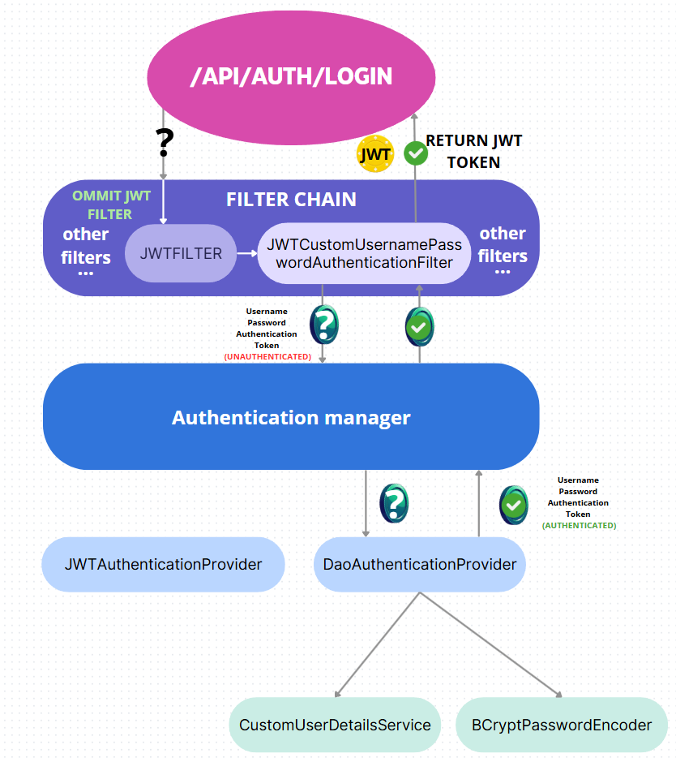
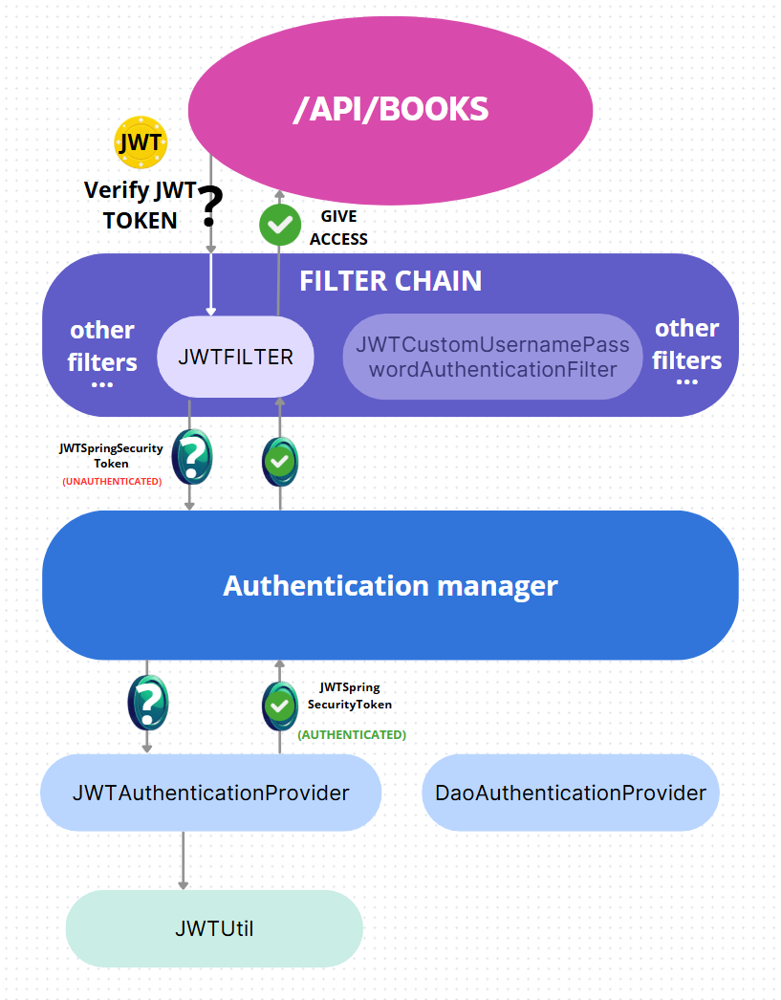
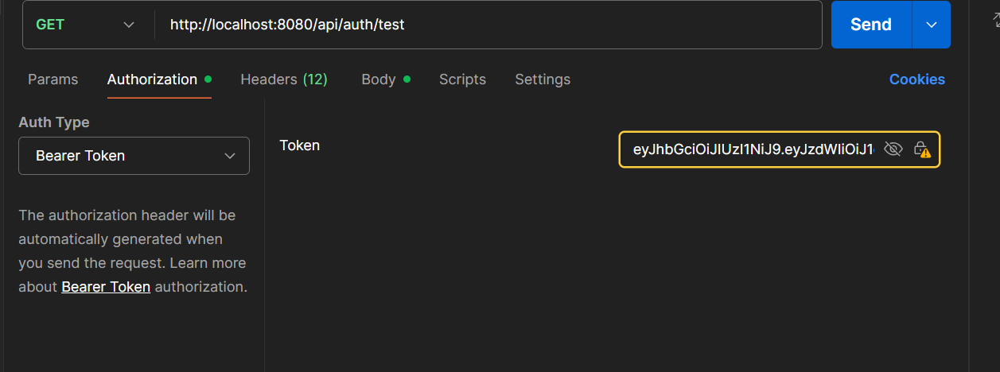

# 📚 Library3000App

**Library3000App** is a Spring Boot-based RESTful application for managing books. It uses **Spring Data JPA** for database interaction and stores data in a **PostgreSQL** database running in **Docker**. The application exposes a secured REST API with JWT-based authentication, which can be tested via **Postman**.

---

## ✨ Features

✅ Retrieve all books
✅ Retrieve a book by ID
✅ Add a new book
✅ Update an existing book
✅ Delete a book
✅ Search books by keyword (Spring JPA query)
✅ Upload and download book covers using **GridFS** (supports JPG and PNG)
✅ Global exception handling
✅ **Spring Security with JWT authentication**
✅ **Role-based access control (USER, ADMIN)**
✅ **Test endpoint accessible only by ADMIN**
✅ **User registration and login with JWT token generation**

---

## 🛠 Requirements

* Java 21
* Gradle
* Docker & Docker Compose
* Postman (for API testing)

---

## 🚀 Setup & Running

### 1️⃣ Start the Database

Run the following command in the project root to start PostgreSQL via Docker Compose:

```sh
docker-compose up -d
```

### 2️⃣ Build the Project

Use Gradle to build the application:

```sh
./gradlew build
```

### 3️⃣ Run the Application

After building the project, navigate to the output directory:

```sh
cd build/libs
```

Then run the application:

```sh
java -jar Library3000-1.0-SNAPSHOT.jar
```

📌 **Liquibase** will automatically initialize the database schema and insert sample data.

---
## 🔐 Authentication & Authorization

The application uses **Spring Security** with **JWT** tokens for authentication and role-based authorization.



### Available Test Users

| Username | Password | Roles |
| -------- | -------- | ----- |
| admin    | admin    | ADMIN |
| user1    | user1    | USER  |
| user2    | user2    | USER  |
| user3    | user3    | USER  |
| user4    | user4    | USER  |
| user5    | user5    | USER  |

---

## 📡 Authentication Endpoints

### 🔑 Login (Get JWT Token)

```
POST http://localhost:8080/api/auth/login
```

**Request Body (JSON):**

```json
{
  "username": "admin",
  "password": "admin"
}
```

**Response:**

* JWT token will be returned in the **Authorization** header as `Bearer <token>`.
* Use this token to authorize subsequent requests.

---

### 📝 Register a New User

```
POST http://localhost:8080/api/auth/register
```

**Request Body (JSON):**

```json
{
  "username": "newuser",
  "password": "newpassword"
}
```

**Response:**

* New user is created with default USER role.
* Then login with the new credentials to get a JWT token.

---

### 🔒 Using the JWT Token

For secured endpoints (including all book-related APIs):

* In Postman, go to the **Authorization** tab
* Choose **Bearer Token** type
* Paste the JWT token (without the `Bearer` prefix)
* Make your API requests


---

### 🛠 Test Endpoint (ADMIN only)

This endpoint is for testing role-based access:

```
GET http://localhost:8080/api/auth/test
```

* This endpoint returns a simple message and is accessible **only by users with the ADMIN role**.
* Trying to access it with a non-admin token will result in a **403 Forbidden** response.


## 📂 Project Structure

```
Library3000/
├── Postman/                            # Postman collection with API requests
├── src/
│   └── main/
│       ├── java/
│       │   └── trela/
│       │       ├── config/             # Spring configuration (Security, Beans, etc.)
│       │       ├── controller/         # REST controllers (Auth, Book, Cover, etc.)
│       │       ├── exception/          # Global and domain-specific exceptions
│       │       ├── model/              # Domain models (User, Book, Role, etc.)
│       │       ├── repository/         # Spring Data JPA repositories
│       │       ├── security/           # Security layer
│       │       │   ├── jwt/            # JWT authentication components
│       │       │   │   ├── handler/    # Custom JWT handlers (success/failure)
│       │       │   │   └── usernamepasswordauth/  # UserDetails and auth filter
│       │       ├── service/            # Business logic and services
│       │       ├── util/               # Utility classes (e.g., GenreTranslator)
│       │       └── Library3000App.java # Main Spring Boot application class
│       └── resources/
│           ├── changelog/              # Liquibase changelog SQL files
│           ├── application.properties  # Main Spring Boot config
│           ├── messages_en.properties  # English messages
│           └── messages_pl.properties  # Polish messages
├── docker-compose.yaml                 # Docker setup for PostgreSQL
├── build.gradle.kts                    # Gradle build config
├── settings.gradle.kts                 # Gradle project settings

```

---

## 📡 API Endpoints (via Postman)

### 📖 Get All Books

```
GET http://localhost:8080/api/books
```

### 📖 Get Book by ID

```
GET http://localhost:8080/api/books/{id}
```

Example:

```
GET http://localhost:8080/api/books/2
```

### ➕ Add a New Book

```
POST http://localhost:8080/api/books
```

**Request Body (JSON):**

```json
{
  "title": "Murder on the Orient Express",
  "description": "Hercule Poirot investigates a murder on a snowbound train.",
  "pages": 256,
  "rating": 4.30,
  "authors": [
    {"name": "Agatha Christie"},
    {"name": "Alex Michaelides"}
  ],
  "genre": {
    "name": "Mystery"
  }
}
```

### ✏️ Update a Book

```
PUT http://localhost:8080/api/books/{id}
```

**Request Body (JSON):**

```json
{
  "title": "UPDATE",
  "description": "UPDATE",
  "pages": 100,
  "rating": 5.00,
  "authors": [
    {"name": "UPDATED AUTHOR"},
    {"name": "UPDATEDAUTHOR2"}
  ],
  "genre": {
    "name": "Mystery"
  }
}
```

### 🔍 Search Books by Keyword

```
GET http://localhost:8080/api/books/search?keyword=tolkien
```

### ❌ Delete a Book

```
DELETE http://localhost:8080/api/books/{id}
```

Example:

```
DELETE http://localhost:8080/api/books/1
```

---

## 📸 Book Cover Upload & Download (GridFS)


### ➕ Upload Book Cover

Upload a book cover image (supported formats: **JPG**, **PNG**) using:

```
POST http://localhost:8080/api/books/{id}/cover
```

**Request:**

* Use `form-data` in Postman.
* Add a key named `coverImage` with the image file you want to upload as the value.

Example:

| Key        | Type | Value               |
| ---------- | ---- | ------------------- |
| coverImage | File | your\_cover.jpg/png |

---

### 📥 Download Book Cover

Retrieve the cover image for a book using:

```
GET http://localhost:8080/api/books/{id}/cover
```

This endpoint returns the image binary data with appropriate content-type (`image/jpeg` or `image/png`) so it can be displayed or saved.

---

Sure! Here's an English addition you can include in your `README.md` under a section like **✅ Tests Included**:

---

## ✅ Tests Included

The project includes both **integration** and **unit tests** to ensure reliability and correctness of key functionalities.

### 🔬 Integration Tests (`controller` package)

Integration tests verify that the application components work together as expected using real HTTP requests and a containerized PostgreSQL instance via **Testcontainers**.

Examples:

* `AuthControllerIT`: Tests user registration and input validation.
* `BookControllerIT`: Covers book creation, retrieval by ID, and listing all books.

These tests use `TestRestTemplate` and start the application on a random port.

### ⚙️ Unit Tests (`service` package)

Unit tests validate individual service logic with mocked dependencies using **JUnit 5** and **Mockito**.

Examples:

* `BookServiceTest`: Verifies authors and genres are properly processed before saving a book.
* `GenreServiceTest`: Ensures genre retrieval works as expected.
* `UserServiceTest`: Validates user registration rules and handles duplicate usernames or invalid inputs.

All tests are located under the `src/test/java/dev/trela/` directory and can be run using:

```sh
./gradlew test
```

Test results will be available in the `build/reports/tests/test/index.html` file after execution.

---

## ⚙️ Technologies Used

* **Java 21** – Core programming language
* **Spring Boot** – Application framework (REST, AOP, Context)
* **Spring Security** – For authentication and authorization
* **Spring Data JPA** – Database persistence and repository abstraction
* **PostgreSQL** – Relational database (running in a Docker container)
* **Liquibase** – Version-controlled database migrations
* **MongoDB GridFS** – For storing and retrieving book cover images
* **Gradle** – Build automation and dependency management
* **Testcontainers** – For integration testing with containerized PostgreSQL
* **JUnit 5 & Mockito** – For unit and integration testing
* **Postman** – For manual testing and API exploration
* **Lombok** – To reduce boilerplate code (e.g., getters, constructors)

---
📌 Make sure Docker is running before starting the application. All API endpoints can be tested using the Postman collection located in the `Postman/` directory.

🗂️ The collection of requests is included in the Postman/ folder — import it into Postman to quickly access and test all endpoints.

---

